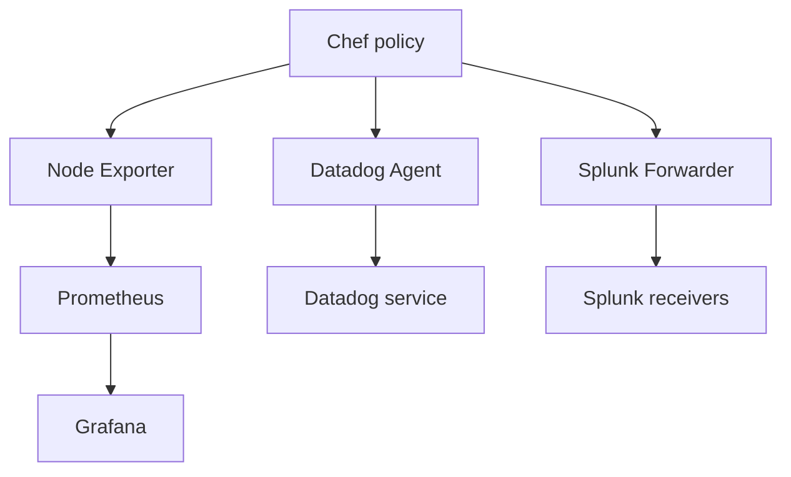

# Architecture

Chef converges files and services. Telemetry traffic travels directly to the configured
backend; Chef is not in the collection or query path.

The default recipe composes optional integrations. Individual custom resources allow
wrapper cookbooks to choose names, secrets, labels and deployment policies independently.
Shared validation rejects malformed paths, destinations and artifact identities before
resources change the machine. Stable ordering prevents configuration churn.

The commercial package resource uses native package providers. It deliberately delegates
repository trust and entitlement management to the organization's existing platform layer.
Node Exporter uses verified upstream archives and a versioned directory for predictable
upgrades. Credentials remain in memory and protected files, outside persisted node data.

Prometheus discovery and the Grafana dashboard can be deployed on a central monitoring
host. They do not require installing the central servers on every observed machine.
